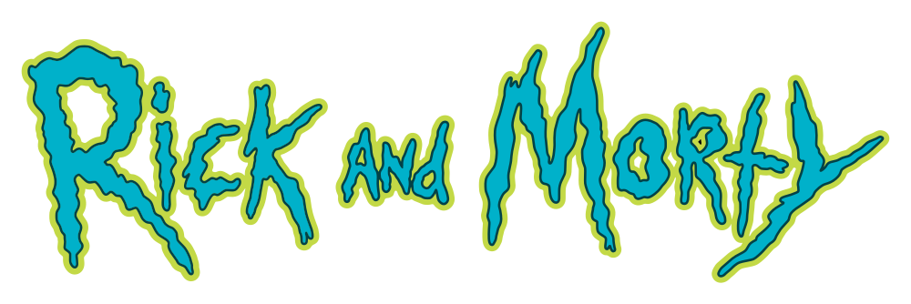

<div align="center">
  
</div>

<br/>

[](http://commitizen.github.io/cz-cli/)

# Rick and Morty UI

This project implements a user interface for the Rick and Morty [API](https://rickandmortyapi.com/documentation), using Reactjs (Typescript, ReduxToolkit, Hooks), and Axios.

It's as an experimental project to test the brillian work of [evanw](https://github.com/evanw/esbuild) on [esbuild](https://esbuild.github.io/), although primarily used as a webpack loader, since opted to use Webpack dev server for [HMR](https://webpack.js.org/guides/hot-module-replacement/), as otherwise it'd require some extra work.

Also, a test-drive for Tailwindcss, used in the project by css class composition.

## Specs

The goals for the project are simple:
- Responsive UI
- Top bar should present the logo
- Two pages
  - Character list view
    - A filter panel in the left side (search by name, status and gender selectables)
    - Content view
      - Character list paginated (20 items per page)
      - Pagination controller
      - Scroll to top CTA
      - Detail page CTA
  - Character detail view
    - Back button CTA
    - Image
    - Details
    - Episodes panel
      - Selectable episodes (max. of 5 episode tabs)
      - Selected episode details

It **DOES NOT** try to fullfil every use-case (preserve history, e.g. navigation history pushstate, server-side middleware to mitigate CORS (it assumes our address is whitelisted by the target endpoint), e2e testing, distribution optimisation, tailwind postcss integration (used the CDN version), etc). 

Similarily, while it should work, the project was developed on the grounds of webkit (Chrome, Brave) and Firefox latest, use as advised.

## Requirements

You'll need `Nodejs`, as developed over `v12`. Assumed [YARN](https://yarnpkg.com/) as the prefered package manager througout the documentation, feel free to use [NPM](https://www.npmjs.com/) by changing the commands in accordance.

Pull the repository to your local and install the dependencies by:

```zsh
yarn install
```

## Development

To do development work, you  an fire the webpack-dev-server by:

```
yarn start
```

## Tests

Run unit-tests by:

```
yarn test
```

## References

[Rick and Morty API](https://rickandmortyapi.com/documentation)

[Esbuild](https://esbuild.github.io/)

## Logo

<div>Repository logo copied from <a href="https://logos.fandom.com/wiki/Rick_and_Morty" title="Freepik">Logopedia</a></div>